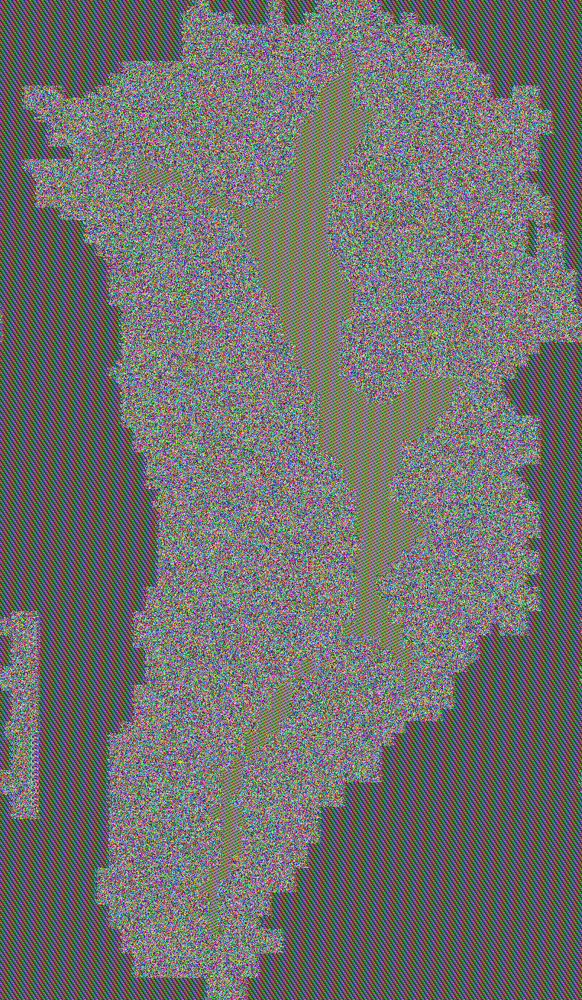

# 1

## 1.1 and 1.2

Developed encrypter.py using AES, salt and padding.

Encrypt shrek.txt using

python3 encrypter.py shrek.txt {key} shrekEncrypted.txt

I used key = 123456789, bad key, you should use always truly random generated kekys, but for this exercise it won matter.

Open shrekEncrypted.txt because we used AES the output file will have 16*n bytes (because of the padding). Use Ghex to read this file.

With a smaller file now.

Encrypt colors.txt using

python3 encrypter.py colors.txt 123456789 colorsEncrypted.txt

If we didn't use salt our key would be exposed as it is saved in the 16 first bytes of the encrypted file, because we are using salt the first 16 bytes are random.

Encrypting colors.txt using 16 and 32 byte size keys.

Uncomment the necessary code to do so.

python3 encrypter.py colors.txt anything colorsEncrypted16.txt

python3 encrypter.py colors.txt anything colorsEncrypted32.txt

Questions:

•What is the output of some encrypted data?

The output of encrypted data is typically a binary or hexadecimal string that represents the ciphertext. This ciphertext is the result of applying an encryption algorithm to the plaintext using a specific key. The ciphertext appears as a random sequence of bytes and does not reveal any information about the original plaintext.

•Can you determine the structure of the text?

No, you cannot determine the structure of the text.

•What are the lengths of the text and the cryptogram?

For AES a multiple of 16, with padding if necessary.

•What is the impact of using different keys sizes (e.g., 16 vs 32 bytes)?

Bigger keys are more secure but slow down the algorithm, I saw no difference in the output however.

Questions:

•Is padding required for all cipher modes?

No, only for cipher modes that devide the plain text in blocks.

•What is the impact of padding when selecting the cryptographic primitive?

Padding is necessary for block ciphers because these require a specific plain text lenght to work, if the plaintext doens't meet this requirements it can be filled with padding.

## 1.3

Develop decrypter.py

Decrypt colorsEncrypted using:

python3 decrypter.py colorsEncrypted.txt {key} colorsDecrypted.txt

key was 123456789 remember?

Now uncomment the necessary lines to see the padding

python3 decrypter.py colorsEncrypted.txt {key} colorsDecryptedWithPadding.txt

Truncating the cryptogram, removing 16 random bytes.

python3 truncater.py colorsEncrypted.txt colorsEncryptedTruncated.txt

Decrypt the new file

python3 decrypter.py colorsEncryptedTruncated.txt 123456789 colorsTruncatedDecrypted.txt

Questions:

• Is padding visible in the decrypted text?

Yes if it isnt removed.

• What happens if the cryptogram is truncated?

We lose all (most) information, maybe i got lucky with the 16 random bytes i removed.

• What happens if the cryptogram lacks some bytes in the beginning?

Becomes impossible to decrypt because we lost the salt or iv.

## 1.4

Done in 1.1

# 2

## 2.1

Already used IV's in 1.

Questions:

•What length should the IV be?

The length of the Initialization Vector (IV) depends on the block size of the encryption algorithm being used. The iv should be of lenght of 1 block.

•What is the impact of repeating the IV while changing the Key for each cipher mode?

ECB does not use IV.

CBC, OFB, CFB uses IV as the block 0 to encrypt block 1 from plain text. Then block 1 encrypted is used to encrypt block 2 plaintext etc etc...

•What is the impact of repeating the Key while changing the IV for each cipher mode?

ECB does not use IV. So repeating the key is dangerous because the key is usually stored in the encrypted file (We didn't do this btw)

CBC, OFB, CFB repeating the key is a no problemo here because the IV is random. A random IV will ensure a different encryption for the same plaintext each and every time.

## 2.2

Develop encrypterECB.py and encrypterCBC.py

Encrypting images (BMP) with ECB and CBC.

ECB will leave a resemblance of the input because the same input will be encrypted to the same output. That wont happen with CBC.

Say hello to greenland.

python3 encrypterECB.py greenland.bmp 123456789 greenland.bmp

python3 encrypterCBC.py greenland.bmp 123456789 greenlandCBC.bmp

Expected output, yay!

## 2.3

Decypting corrupted data.

Develop decrypterCBC.py and decrypterECB.py

Decrypt normal data.

